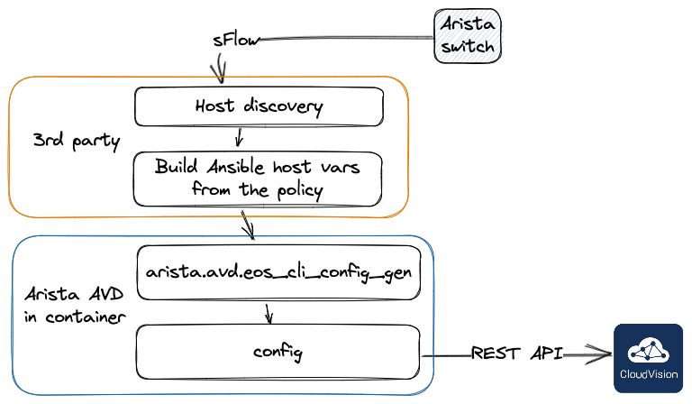
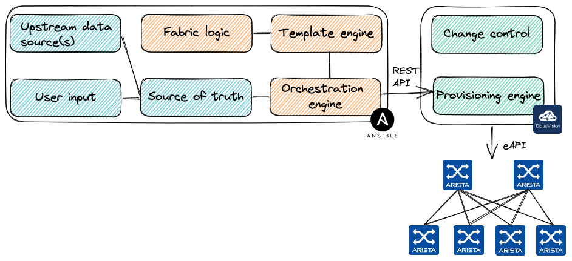
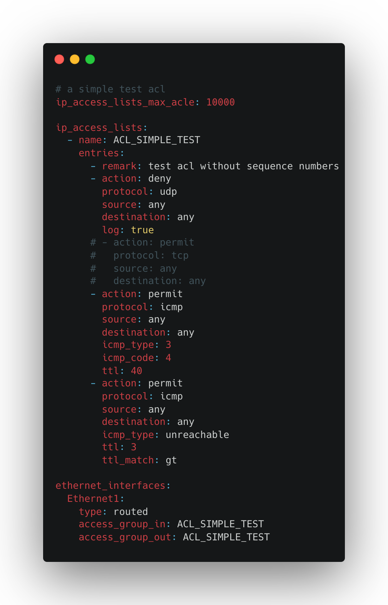

# Demo

## ACL with AVD

<!-- Do not add page number on this slide -->
<!--
_paginate: false
-->

```text
How to Generate ACL Config Using AVD

Petr Ankudinov, 2023
```


---

# Credits and References

<style scoped>section {font-size: 22px;}</style>

<!-- Add footer starting from this slide -->
<!--
footer: ''
-->

This repository is based on many awesome open source repositories and some free/commercial Github features:

- [VS Code](https://code.visualstudio.com/)
- [DevContainers](https://code.visualstudio.com/docs/remote/containers)
- [Marp](https://marp.app/)
- [Excalidraw VS Code Plugin](https://github.com/excalidraw/excalidraw-vscode)
- [Github Actions](https://github.com/features/actions)
- [Github Pages](https://pages.github.com/)
- [Github Codespaces](https://github.com/features/codespaces)
- [Carbon](https://carbon.now.sh/)
- And many more...

All photos are taken from [Pexels](https://www.pexels.com/) and [Unsplash](https://unsplash.com/). Excellent free stock photos resources. It's not possible to reference every author individually, but their work is highly appreciated.

---

# Building Blocks



---

# What is Ansible AVD?

<style scoped>section {font-size: 22px;}</style>

- AVD stands for Arista Validated Design
- Documentation is available at [avd.arista.com](https://avd.arista.com/)
- Historically it is based on the [EVPN Deployment Guide](https://www.arista.com/custom_data/downloads/?f=/support/download/DesignGuides/EVPN_Deployment_Guide.pdf), but now it's much more advanced and developing fast.
- Ansible AVD repository is available here: [github.com/aristanetworks/ansible-avd](https://github.com/aristanetworks/ansible-avd)
- The Ansible AVD collection is relying on:
  - [EOS foundational modules](https://galaxy.ansible.com/arista/eos) maintained by RedHat: `ansible-galaxy collection install arista.eos`
  - [Ansible CVP modules](https://github.com/aristanetworks/ansible-cvp) to interact with CloudVision Portal when required

---

# Typical Ansible AVD Automation Workflow

<style scoped>section {font-size: 22px;}</style>

<div class="columns">
<div>

- Collect user input from various data sources and aggregate in a single source of truth. For ex. git repository.
- Generate low level variables from abstracted input data using sophisticated fabric logic
- Parse Jinja2 templates to produce plain text configs
- Push plain text configs via CloudVision Portal as change-control "proxy" or directly to devices via eAPI.

> **BUT**: AVD can simply parse relevant templates and generate partial configuration!

</div>
<div>



</div>
</div>

---

# The Demo

<style scoped>section {font-size: 22px;}</style>

- Start Github Codespace with AVD pre-installed
- Add TCP rule to hostvars
- Run playbook to generate ACL config
- Fail playbook with limit to demonstrate error handling



---

# Potential Challenges

- A lot of testing is required to ensure that solution works as expected
- Possible caveats:
  - discovery time with sFlow
  - host moves
  - hardware limits
  - etc.

---

Q&A
